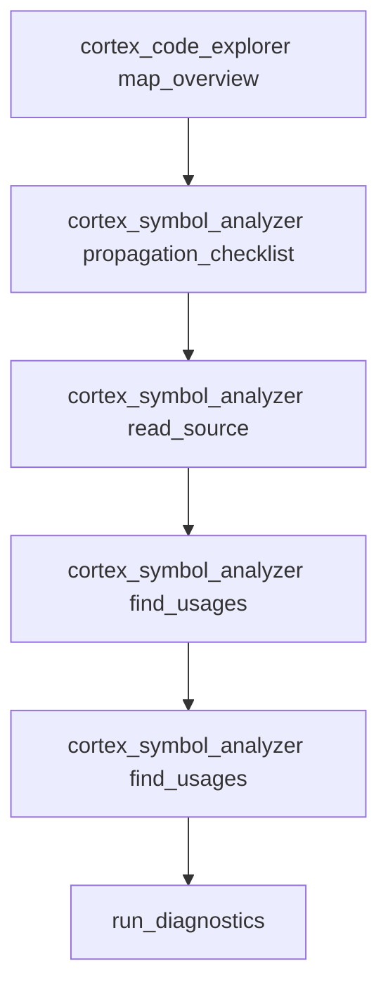
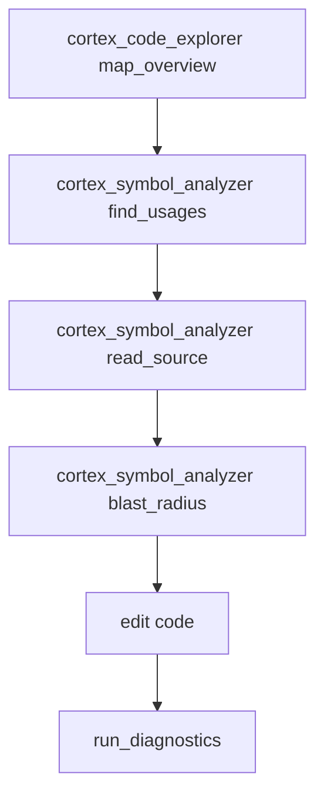

# 🤖 Agentic Workflow Playbook (CortexAST)

CortexAST isn’t just a token reducer — it’s an **architect-grade orchestrator**.
It gives AI agents deterministic, AST-level levers that behave like a senior engineer’s workflow:
**map the terrain → measure blast radius → change the smallest safe unit → verify structurally**.

This playbook shows 3 real-world agent workflows you can copy/paste into your own agent rules.

---

## 1) Cross-Boundary Refactor (Proto → Rust → TypeScript)

### The Challenge (why normal IDE tools fail)
A “simple” change like adding `max_tokens` to a core request type (e.g. `ConvertRequest`) becomes a minefield when:

- The type exists in **multiple schemas** (Proto + generated stubs + server DTO + client DTO).
- Usages are **cross-boundary** (Rust backend + TS frontend + Python tooling).
- Grep-based discovery is noisy (comments/strings) and incomplete (generated code is often ignored).
- The *real* risk isn’t compilation — it’s **silent drift** (one client updated, another forgotten).

### The CortexAST Solution
Use CortexAST as the “blast-radius compiler” for shared contracts:

- `propagation_checklist(symbol_name: ...)` produces a strict cross-language checklist.
- `find_usages` gives **semantic** hits (not string matches) to locate callsites that must be updated.
- `read_symbol` extracts only the exact structs/messages/handlers you need — no file dumps.
- Optional: `run_diagnostics` validates compilation after propagation is complete.

### Agent Execution Log (pseudo-transcript)
> Format: **Intent → Action → Signal** (what the agent observes). This is the *external* reasoning trail an agent can safely show.

```text
[Goal] Add field `max_tokens` to `ConvertRequest` across Proto, Rust, and TS.

[1] Discover contract definition
  Intent: Find the canonical definition and generated copies.
  Action: cortex_code_explorer(action=map_overview, target_dir=".", search_filter="ConvertRequest|proto|grpc")
  Signal: Sees proto files + server handlers + client types surfaced in one map.

[2] Compute blast radius (cross-boundary)
  Intent: Don’t miss a single propagation target.
  Action: cortex_symbol_analyzer(action=propagation_checklist, symbol_name="ConvertRequest", target_dir=".", ignore_gitignore=true)
  Signal: Checklist grouped by Proto / Rust / TypeScript / Python with file hits.

[3] Update the schema (source of truth)
  Intent: Make the contract change in the canonical schema first.
  Action: cortex_symbol_analyzer(action=read_source, path="proto/convert.proto", symbol_name="ConvertRequest", skeleton_only=true)
  Signal: Extracts the message definition only; agent adds `max_tokens` safely.

[4] Update server-side types and adapters
  Intent: Fix the Rust boundary layer and internal plumbing.
  Action: cortex_symbol_analyzer(action=find_usages, symbol_name="ConvertRequest", target_dir="src")
  Signal: Categorized hits: TypeRefs / FieldInits / Calls for exact edits.

[5] Update TS client + any wrappers
  Intent: Ensure frontend clients compile and behave.
  Action: cortex_symbol_analyzer(action=find_usages, symbol_name="ConvertRequest", target_dir="packages")
  Signal: Exact TypeRefs in TS client DTOs and API call builders.

[6] Validate and close the loop
  Intent: Confirm nothing was missed.
  Action: run_diagnostics(repoPath="/path/to/repo")
  Signal: Clean compile (or errors point directly to missing propagation items).
```

### Mermaid Tool Flow


---

## 2) Safe Surgical Edit (Chronos Time Machine + Structural Verification)

### The Challenge (why `git diff` is the wrong primitive for agents)
Editing a complex function with standard tools typically produces:

- Huge diffs dominated by formatting/whitespace or unrelated line churn.
- “Search then scroll” workflows that cause **context overread** and errors.
- No deterministic guarantee you didn’t accidentally change semantics elsewhere.

### The CortexAST Solution
Use Chronos for “surgery with an MRI”:

- `save_checkpoint` snapshots a symbol **as a structural unit**.
- Make the smallest change possible (often by editing only the symbol’s file region).
- `compare_checkpoint` verifies the *semantic* delta without whitespace/line-number noise.
- Optional: `call_hierarchy` measures blast radius before touching a hot function.

### Agent Execution Log (pseudo-transcript)

```text
[Goal] Modify a complex function safely (e.g., "slice_to_xml") without collateral damage.

[1] Scope the blast radius
  Intent: Avoid refactoring a function that has deep coupling unless necessary.
  Action: cortex_symbol_analyzer(action=blast_radius, symbol_name="slice_to_xml", target_dir="src")
  Signal: Incoming callers + outgoing calls show how risky this edit is.

[2] Snapshot the function (pre-op)
  Intent: Create a deterministic rollback + diff baseline.
  Action: cortex_chronos(action=save_checkpoint, path="src/slicer.rs", symbol_name="slice_to_xml", semantic_tag="pre-max-tokens")
  Signal: Chronos stores AST snapshot under .cortexast/checkpoints/.

[3] Extract minimal context
  Intent: Read only what’s needed to change the behavior.
  Action: cortex_symbol_analyzer(action=read_source, path="src/slicer.rs", symbol_name="slice_to_xml", skeleton_only=true)
  Signal: Gets the exact function body and signature, not 800 lines of the file.

[4] Apply the edit
  Intent: Implement the change with smallest surface area.
  Action: (edit source) — keep scope inside the symbol.
  Signal: Local change done.

[5] Structural verification (post-op)
  Intent: Confirm only intended structural changes occurred.
  Action: cortex_chronos(action=compare_checkpoint, symbol_name="slice_to_xml", tag_a="pre-max-tokens", tag_b="__live__", path="src/slicer.rs")
  Signal: Clear structural diff of the symbol (no whitespace noise).

[6] Compile verification
  Intent: Ensure build is green.
  Action: run_diagnostics(repoPath="/path/to/repo")
  Signal: Compiler errors (if any) map directly to AST lines.
```

### Mermaid Tool Flow
```mermaid
flowchart TD
  A[cortex_symbol_analyzer blast_radius] --> B[cortex_chronos save_checkpoint]
  B --> C[cortex_symbol_analyzer read_source]
  C --> D[edit code]
  D --> E[cortex_chronos compare_checkpoint (__live__)]
  E --> F[run_diagnostics]
```

---

## 3) Navigating the Unknown (Zero‑Shot Onboarding in a Massive Legacy Repo)

### The Challenge (why agents get “lost”)
Large legacy repos punish naïve exploration:

- `tree` shows filenames, not architectural meaning.
- `read_file` on random modules burns the entire context window.
- `grep` returns false positives, and misses semantics (overloads, shadowed names).
- Agents end up “touring” the repo instead of fixing the bug.

### The CortexAST Solution
Treat onboarding like incident response:

- `map_repo(search_filter=...)` produces a **God’s-eye index** of relevant surfaces.
- `find_usages` builds a reliable graph of where the bug-relevant symbols flow.
- `read_symbol` pulls the smallest executable mental model: the specific function/type.
- Optional: `get_context_slice(query=...)` deep-dives only after the agent has a hypothesis.

### Agent Execution Log (pseudo-transcript)

```text
[Goal] Find and fix a bug in a repo you’ve never seen before — without full-file reads.

[1] Build a scoped architecture map
  Intent: Identify the smallest set of files that can contain the bug.
  Action: cortex_code_explorer(action=map_overview, target_dir=".", search_filter="auth|token|session|middleware", max_chars=15000)
  Signal: Finds top-level modules + exported symbols likely related to the bug.

[2] Pick a suspicious symbol and trace semantics
  Intent: Convert “guessing” into deterministic navigation.
  Action: cortex_symbol_analyzer(action=find_usages, symbol_name="validate_token", target_dir=".")
  Signal: Categorized callers show entrypoints and high-leverage files.

[3] Read only the critical nodes
  Intent: Build a minimal mental model from the AST graph.
  Action: cortex_symbol_analyzer(action=read_source, path="src/auth.rs", symbol_name="validate_token")
  Signal: Exact function extracted; agent identifies faulty branch / edge-case.

[4] Confirm impact radius before editing
  Intent: Ensure the change won’t break unrelated flows.
  Action: cortex_symbol_analyzer(action=blast_radius, symbol_name="validate_token", target_dir="src")
  Signal: Incoming/outgoing graph guides safe edits and test targeting.

[5] Patch and verify
  Intent: Fix, then let the compiler be the judge.
  Action: run_diagnostics(repoPath="/path/to/repo")
  Signal: Errors point to exact AST lines; iterate until green.
```

### Mermaid Tool Flow


---

## Copy/Paste Agent Rules (TL;DR)

If your agent only remembers one thing:

- Always start with `cortex_code_explorer(action=map_overview)`.
- Navigate with `cortex_symbol_analyzer(action=find_usages)`.
- Read with `cortex_symbol_analyzer(action=read_source)` (`skeleton_only: true` if large).
- Before shared types: `propagation_checklist`.
- Before edits: `save_checkpoint` → after edits: `compare_checkpoint` (tip: `tag_b="__live__"`).
- When stuck: `run_diagnostics`.
